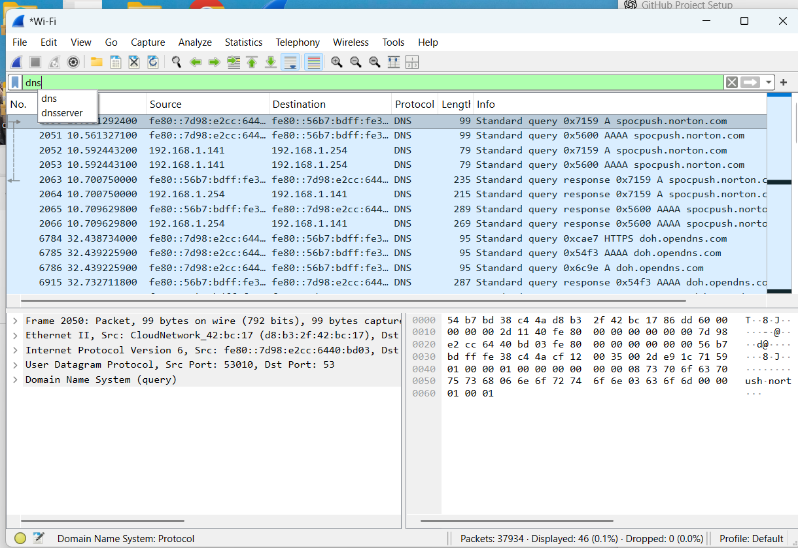
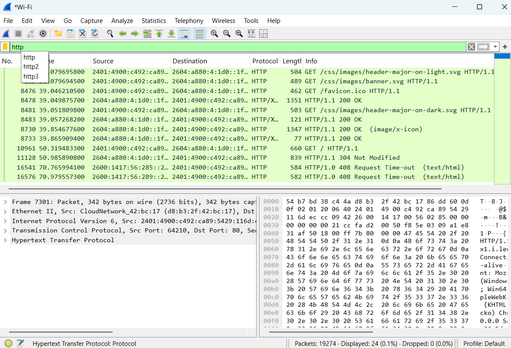
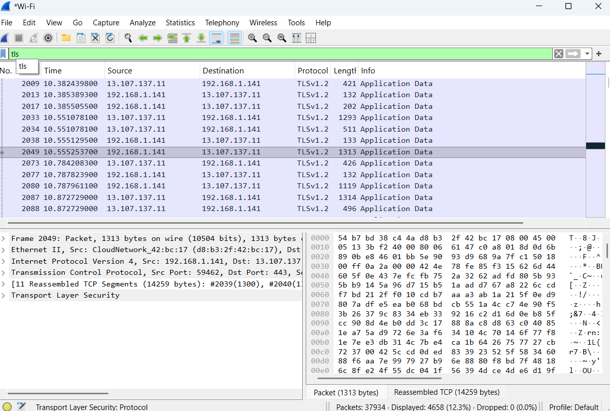

# Wireshark Packet Analyzer

A Streamlit-based network packet analyzer built using PyShark and Wireshark TShark.  
This project allows users to upload `.pcap` or `.pcapng` files and analyze network traffic including DNS, HTTP, and TLS packets.

---

## Features

- Upload `.pcap` and `.pcapng` files
- Analyze network packets
- Detect:
  - HTTP packets
  - DNS queries
  - TLS handshakes
- Interactive Streamlit dashboard
- Protocol statistics visualization
- Export packet details to CSV
- Simple and user-friendly UI

---

## Technologies Used

- Python
- Streamlit
- PyShark
- Pandas
- Matplotlib
- Wireshark / TShark

---

## Project Structure

```text
wireshark-packet-analyzer/
│
├── captures/
├── screenshots/
│   ├── dns.png
│   ├── http.png
│   └── tls.png
│
├── venv/
├── app.py
├── requirements.txt
├── README.md
└── sample.pcapng
```

---

## Installation

### 1. Clone Repository

```bash
git clone https://github.com/your-username/wireshark-packet-analyzer.git
cd wireshark-packet-analyzer
```

---

### 2. Create Virtual Environment

```bash
python -m venv venv
```

---

### 3. Activate Virtual Environment

#### Windows

```bash
venv\Scripts\activate
```

#### Linux / macOS

```bash
source venv/bin/activate
```

---

### 4. Install Dependencies

```bash
pip install -r requirements.txt
```

---

## Install Wireshark & TShark

Download Wireshark:

[Wireshark Official Website](https://www.wireshark.org/download.html?utm_source=chatgpt.com)

During installation enable:

- TShark
- Add Wireshark to PATH

Verify installation:

```bash
tshark -v
```

---

## Run the Project

```bash
streamlit run app.py
```

Open browser:

```text
http://localhost:8501
```

---

## How to Use

1. Start the Streamlit application
2. Upload a `.pcap` or `.pcapng` file
3. View protocol statistics
4. Analyze DNS, HTTP, and TLS packets
5. Export packet data as CSV

---

## Screenshots

### DNS Packet Analysis



---

### HTTP Packet Analysis



---

### TLS Packet Analysis



---

## Sample Output

The analyzer provides:

- Protocol statistics
- Source & destination IP analysis
- Packet length information
- CSV export reports

CSV Columns:

- Protocol
- Source IP
- Destination IP
- Packet Length
- Info

---

## Future Improvements

- Live packet capture support
- Real-time traffic monitoring
- Advanced filtering
- Threat detection
- GeoIP visualization

---

## Author

Shivang Vijay

---

## License

This project is developed for educational purposes.